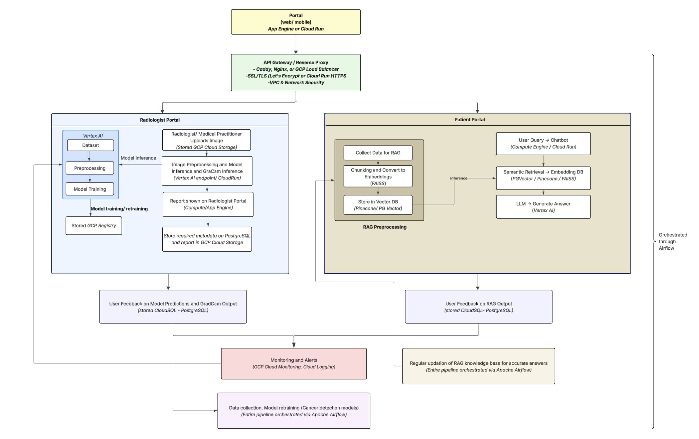

# MedScan AI

AI-powered radiological assistant for CT scan analysis with explainable AI and patient engagement RAG to answer questions about their report's content.

Note: This project is in the initial development phase. Repository structure, naming conventions, technology choices, and implementation details are subject to change based on ongoing technical discussions and requirements refinement.

## About MedScan AI

Scope - Click [here](docs/Scoping.pdf) 

## Requirements

- Python 3.10+
- Google Cloud Platform account
- Docker (optional)
- gcloud CLI

## Installation

```bash
# Clone repository
git clone https://github.com/rjaditya-2702/MedScan_ai.git
cd medscan-ai

# Create virtual environment
python -m venv venv
source venv/bin/activate  # On Windows: venv\Scripts\activate

# Install dependencies
pip install -r requirements.txt
```

## Configuration

```bash
# Copy environment template
cp .env.example .env

# Configure GCP credentials
gcloud auth login
gcloud config set project YOUR_PROJECT_ID
gcloud auth application-default login
```

## Project Structure

```
├── DataPipeline
│   ├── README.md
│   ├── config
│   │   ├── gcp_config.py
│   │   ├── metadata.yml
│   │   ├── rag_pipeline.yml
│   │   ├── synthetic_data.yml
│   │   └── vision_pipeline.yml
│   ├── data.dvc
│   ├── docs
│   │   └── schema_statistics.md
│   ├── experiment
│   │   └── md_modification.ipynb
│   ├── requirements.txt
│   ├── scripts
│   │   ├── RAG
│   │   │   ├── __init__.py
│   │   │   ├── alert_utils.py
│   │   │   ├── analysis
│   │   │   │   ├── anomalies_and_bias_detection.py
│   │   │   │   ├── baseline_stats.json
│   │   │   │   ├── drift.py
│   │   │   │   ├── main.py
│   │   │   │   └── validator.py
│   │   │   ├── chunking.py
│   │   │   ├── common_utils.py
│   │   │   ├── create_urls_file.py
│   │   │   ├── data
│   │   │   │   ├── scraped_baseline.jsonl
│   │   │   │   └── scraped_updated.jsonl
│   │   │   ├── embedding.py
│   │   │   ├── indexing.py
│   │   │   ├── main.py
│   │   │   ├── requirements.txt
│   │   │   ├── scraper.py
│   │   │   ├── url_manager.py
│   │   │   ├── urls_baseline.json
│   │   │   └── urls_new.json
│   │   ├── data_acquisition
│   │   │   └── fetch_data.py
│   │   └── data_preprocessing
│   │       ├── baseline_synthetic_data_generator.py
│   │       ├── process_lungcancer.py
│   │       ├── process_tb.py
│   │       └── schema_statistics.py
│   ├── setup_gcs_bucket.sh
│   └── tests
│       ├── baseline_stats.json
│       ├── data_acquisition
│       │   └── fetch_data_test.py
│       ├── data_preprocessing
│       │   ├── baseline_synthetic_data_generator_test.py
│       │   ├── preprocess_lung_cancer_test.py
│       │   ├── preprocess_tb_test.py
│       │   └── schema_statistics_test.py
│       ├── test_chunking.py
│       ├── test_embedding.py
│       ├── test_indexer.py
│       ├── test_rag_analysis_integration.py
│       ├── test_rag_anomalies_and_bias_detection.py
│       ├── test_rag_drift.py
│       ├── test_rag_validator.py
│       └── test_scraper.py
├── README.md
├── VISION_README.md
├── airflow
│   ├── Dockerfile
│   ├── README.md
│   ├── dags
│   │   ├── medscan_vision_pipeline.py
│   │   └── rag_data_pipeline.py
│   └── docker-compose.yml
├── assets
│   └── high_level_architecture.png
├── docs
│   ├── DVC.md
│   └── Scoping.pdf
├── requirements-pipeline.txt
└── requirements.txt
```

### High Level Architecture



## Usage

### Running the Application


### API Endpoints

TBD - API documentation pending implementation

### Docker

```bash
# Build image
docker build -t medscan-ai .

# Run container
docker run -p 8080:8080 --env-file .env medscan-ai
```

## Development

### Running Tests

```bash
# Run all tests
pytest

# Run with coverage
pytest --cov=src tests/
```

### Code Style

- PEP 8 compliance
- Black formatter
- 80% minimum test coverage

## Deployment

### GCP Deployment

TBD - Deployment instructions pending infrastructure setup

### Required GCP Services

- Cloud Storage
- Vertex AI
- Cloud Run
- Cloud SQL
- Pub/Sub
- Cloud Composer

## Monitoring

- Cloud Monitoring dashboards
- Cloud Logging for application logs
- Vertex AI Model Monitoring

## Data

### Datasets Used

- CT Scan Lung Cancer Dataset
- Tuberculosis  (TB)

### Data Pipeline

TBD - Pipeline documentation pending implementation

## Contributing

TBD

## License

TBD

## Support

TBD
